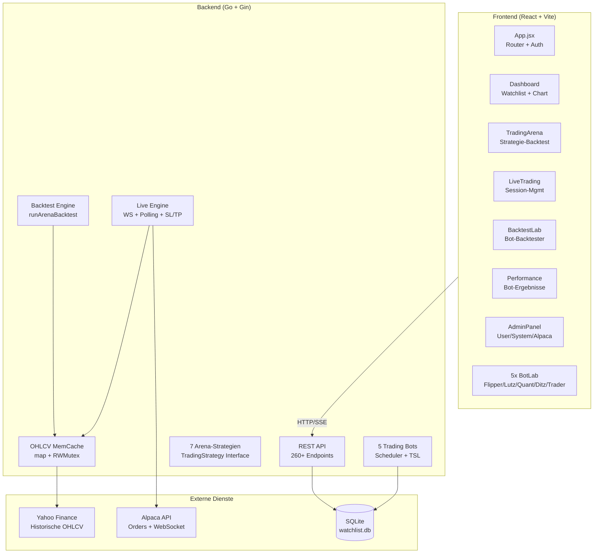
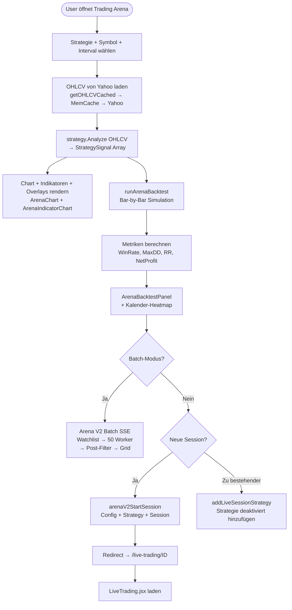
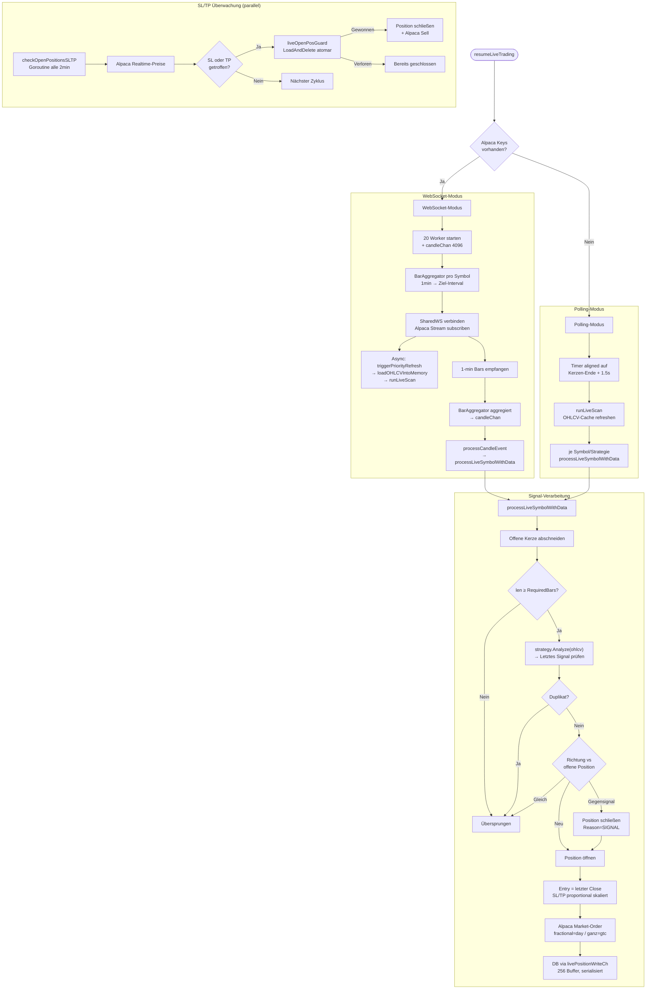
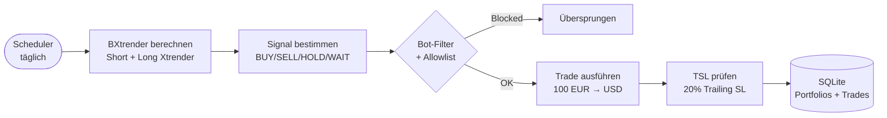
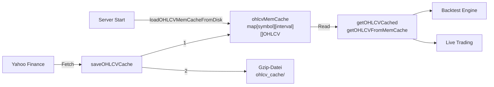

# FlipperCapital

Aktienanalyse-Webapp mit automatisierten Handelsbots und Intraday-Trading-Arena.

## Stack
- **Backend:** Go + Gin + GORM + SQLite (`watchlist.db`) — einzelne Datei `backend/main.go` (~17k Zeilen)
- **Frontend:** React 18 + Vite + Tailwind CSS + `lightweight-charts` + `@tanstack/react-table`
- **Infra:** Docker Compose, NGINX als Reverse Proxy
- **Externe APIs:** Yahoo Finance (historische Daten), Alpaca (Live-Trading, WebSocket)

## Kommandos
```
docker-compose up -d --build          # Alles starten
cd frontend && npm run dev            # Frontend Dev
cd frontend && npx vite build         # Frontend Build
cd backend && go run main.go          # Backend Dev
sqlite3 backend/watchlist.db          # DB inspizieren
node frontend/src/tests/performance.test.mjs  # Tests
```

## Regeln
- Antworte **kurz und direkt**, auf Deutsch
- Bei Aufgaben mit >3 Dateien oder unklarem Scope: **zuerst Plan**, dann ausführen
- Nur relevante Dateien ändern — keine "Sicherheits-Refactors"
- Nach Code-Änderungen: `npx vite build` prüfen
- Commit nur wenn explizit verlangt

---

## Programmablaufplan (Mermaid)

### 1. System-Architektur



### 2. Trading Arena Flow (Backtest → Session → Live)



### 3. Live Trading Signal-Pipeline



### 4. Bot-Trading Flow (Monatlich)



### 5. Datenfluss OHLCV-Cache



---

## Frontend-Struktur

### Seiten & Routen (22 Routes)
| Pfad | Komponente | Auth | Beschreibung |
|------|-----------|------|--------------|
| `/` | Dashboard | - | Watchlist + Chart + Backtest |
| `/login`, `/register` | Login/Register | - | Auth mit Invite-Code |
| `/portfolio` | PortfolioManage | Auth | Portfolio verwalten |
| `/compare` | PortfolioCompare | Auth | Portfolios vergleichen |
| `/tracker` | StockTracker | - | Aktien-Tracking |
| `/performance` | Performance | - | Bot-Performance (5 Modi) |
| `/signal-liste` | SignalList | - | Signal-Liste mit Filter |
| `/flipperbot` | FlipperBot | - | Bot-Info/Landing |
| `/help` | Help | - | Hilfe-Dokumentation |
| `/flipperbot-lab` ... `/trader-lab` | 5x BotLab | - | Bot-Backtester |
| `/backtest-lab` | BacktestLab | Auth | Advanced BXtrender-Backtester |
| `/trading-arena` | TradingArena | Auth | Arena V2 Strategie-Backtester |
| `/live-trading/:id?` | LiveTrading | Auth | Live-Sessions + Positionen |
| `/daytrading-stats` | DaytradingStats | Auth | Daytrading-Statistiken |
| `/admin` | AdminPanel | Auth | Admin (Users/System/Alpaca) |
| `/profile` | Profile | Auth | Profil + Einstellungen |

### Wichtige Dateien
```
frontend/src/
├── App.jsx                    # Router + Auth-Guard
├── components/
│   ├── Dashboard.jsx          # Hauptseite: Watchlist + Chart
│   ├── TradingArena.jsx       # Arena V2: Backtest + Batch + Heatmap
│   ├── LiveTrading.jsx        # Live-Sessions, Positionen, Alpaca
│   ├── BacktestLab.jsx        # BXtrender-Backtester (5 Modes)
│   ├── AdminPanel.jsx         # Admin: Users, Stats, Alpaca-Accounts
│   ├── ArenaChart.jsx         # Candlestick + Overlays (lightweight-charts)
│   ├── ArenaIndicatorChart.jsx # Sub-Chart (Histogramm, Linien)
│   ├── ArenaBacktestPanel.jsx # Metriken-Grid + Trade-Tabelle
│   ├── ArenaCalendarHeatmap.jsx # Kalender-Heatmap mit Drilldown
│   ├── Header.jsx / Sidebar.jsx # Navigation
│   ├── Performance.jsx        # Bot-Performance-Anzeige
│   ├── FlipperBot/Lutz/Quant/Ditz/TraderLab.jsx # Bot-Labs
│   └── ... (35 Komponenten total)
├── utils/
│   ├── arenaConfig.js         # Strategien, Parameter, Intervals
│   ├── bxtrender.js           # BXtrender-Berechnung
│   └── currency.js            # Währungskonvertierung
├── contexts/
│   ├── CurrencyContext.jsx    # Globale Währung (USD/EUR/...)
│   └── TradingModeContext.jsx # Bot-Modus (Defensive/.../Trader)
└── hooks/
    └── useBlockedStocks.js    # Bot-Blocklist (5min Cache)
```

---

## Backend API (260+ Endpoints)

### Haupt-Gruppen
| Gruppe | Prefix | Endpoints | Auth |
|--------|--------|-----------|------|
| Auth | `/api/login,register,verify` | 4 | Public |
| Stocks & Search | `/api/stocks,search,quote` | 8 | Mixed |
| Portfolio | `/api/portfolio` | 11 | Auth |
| Performance (5 Modi) | `/api/performance/*` | 15 | Mixed |
| Bot-Management (5 Bots) | `/api/{bot}/*` | ~120 | Admin |
| Trading Arena | `/api/trading/arena/*` | 6 | Auth |
| Live Trading | `/api/trading/live/*` | 18 | Auth/Admin |
| Backtest Lab | `/api/backtest-lab/*` | 4 | Auth |
| Alpaca Accounts | `/api/admin/alpaca-accounts` | 6 | Admin |
| Admin System | `/api/admin/*` | 25 | Admin |
| Categories | `/api/categories` | 5 | Admin |
| Trading Watchlist | `/api/trading/watchlist` | 4 | Admin |
| Notifications | `/api/notifications` | 4 | Auth |
| Signals & History | `/api/signal-list,performance/history` | 5 | Mixed |

### Bot-Endpoints (pro Bot identisch, 5x)
Jeder Bot (`flipperbot`, `lutz`, `quant`, `ditz`, `trader`) hat:
`update, portfolio, actions, performance, reset, backfill, sync, logs, history, completed-trades, pending-trades, todos, trade CRUD, simulated-portfolio/performance`

---

## Architektur-Details

### BXtrender-Berechnung
Short EMA(5,20) → RSI(15)-50 = **Short Xtrender**; Long EMA(20) → RSI(15)-50 = **Long Xtrender**

### Signal-Bestimmung (alle Modi)
BUY=frisch (≤1 Monat), HOLD=Position>1 Monat, SELL=frisch (≤1 Monat), WAIT=keine Position+SELL>1 Monat

### Datenquellen-Trennung
- **Backtest/Prefetch → Yahoo Finance** (historisch, kostenlos, 20+ concurrent)
- **Live-Trading → Alpaca** (WebSocket Realtime-Bars, REST Orders/Quotes)

### OHLCV Memory-Cache
`ohlcvMemCache` (map[string]map[string][]OHLCV) + RWMutex. Startup: Gzip-Dateien laden. Writes: Memory + Gzip parallel.

### Position-Guard (Race-Condition-Schutz)
`liveOpenPosGuard` (sync.Map) Key=`"sessionID:strategyID:symbol"` — atomarer Schutz gegen Doppel-Close (Monitor vs Worker)

### Async DB-Writes
`livePositionWriteCh` (chan func(), 256 Buffer) — serialisiert Position-Writes, verhindert SQLite-Lock-Contention

---

## Bot-Trading-Regeln

5 Bots: **Lutz** (aggressiv) → **Trader** (schnell) → **FlipperBot** (defensiv) → **Quant** (Trend+MA) → **Ditz** (konservativ)

### Gemeinsam
- 100 EUR/Trade, 20% TSL, Allowlist, Bot-Filter, Re-Entry nur nach BUY→SELL Zyklus
- User-IDs: FlipperBot=999999, Lutz=999998, Quant=999997, Ditz=999996, Trader=999995

### Bot-Regeln
| Bot | BUY | SELL | MA-Filter |
|-----|-----|------|-----------|
| FlipperBot | Red→Green ODER 4x light-red | Erste dark-red | - |
| Lutz | 1. light-red ODER Red→Green | Erste dark-red | - |
| Quant | short>0 AND long>0 + price>EMA200 | short<0 OR long<0 | EMA(200) |
| Ditz | short>0 AND long>0 + price>EMA200 | short<0 AND long<0 | EMA(200) |
| Trader | T3 Rot→Grün | T3 Grün→Rot | - |

---

## Trading Arena — 7 Strategien

| Key | Name | TF | Kern-Logik |
|-----|------|----|-----------|
| `regression_scalping` | Regression Scalping [BETA] | 5m | Poly-Regression-Band → AO Farbflip → HA Bestätigung |
| `hybrid_ai_trend` | NW Bollinger Bands | 5m | NW-geglättete 4-Level BB + Hybrid-Filter |
| `smart_money_flow` | Smart Money Flow [BETA] | 4h | Vol-Flow → ATR-Bänder → Regime State-Machine |
| `hann_trend` | Hann Trend DMH+SAR | 1h | DMH Hann-FIR + Parabolic SAR 4-Phasen |
| `gmma_pullback` | GMMA Pullback | 1h | GMMA-Osc Crossover + S/R-Zonen |
| `macd_sr` | MACD + S/R | 1h | MACD + Fractal S/R-Filter + Hybrid-Option |
| `trippa_trade` | TrippaTrade RSO [BETA] | 1h | Dual-MACD State-Machine + Choppy-Filter |

Alle implementieren: `TradingStrategy` (Analyze), `IndicatorProvider` (Sub-Chart), `OverlayProvider` (Price-Chart)

### Backtest Engine
- `strategy.Analyze(ohlcv)` → `[]StrategySignal{Index, Direction, Entry, SL, TP}`
- Bar-by-Bar: Phase 1 (Open): Signal → Close+Open. Phase 2 (Intrabar): SL/TP, **SL vor TP**
- Metriken: WinRate, TotalReturn, AvgReturn, MaxDrawdown, NetProfit, RiskReward

### Arena V2 Batch (SSE)
Watchlist → Prefetch (Yahoo, 20 concurrent) → 50 Worker Backtest → Post-Filter → `arena_v2_batch_results`

### Live Session Lifecycle
1. **Erstellen:** Arena → `arenaV2StartSession` → Config + Strategy + Session (inaktiv)
2. **Multi-Strategy:** `addLiveSessionStrategy` → Toggle nur bei gestoppter Session
3. **Starten:** `resumeLiveTrading` → WS-Modus (Alpaca) oder Polling-Modus
4. **Stoppen:** `stopLiveTrading` → StopChan, MANUAL-Close, Alpaca Sell, WS trennen

---

## DB-Tabellen

### Arena & Live Trading
`live_trading_sessions`, `live_session_strategies`, `live_trading_positions`, `live_trading_configs`, `live_trading_logs`, `arena_v2_batch_results`, `arena_strategy_settings`, `arena_backtest_histories`, `ohlcv_cache`, `trading_watchlist_items`, `alpaca_accounts`

### Bots & Performance
`bot_positions`, `bot_trades`, `bot_logs`, `bot_todos`, `stock_performance` (5 Tabellen pro Modus), `users`, `stocks`, `categories`, `portfolios`, `portfolio_trades`, `notifications`, `activities`

---

## Wichtige Pfade
| Pfad | Beschreibung |
|------|-------------|
| `backend/main.go` | Gesamter Backend-Code (~17k Zeilen) |
| `frontend/src/components/` | 35 React-Komponenten |
| `frontend/src/utils/arenaConfig.js` | Strategie-Definitionen + Parameter |
| `frontend/src/utils/bxtrender.js` | BXtrender-Berechnung (Frontend) |
| `frontend/src/utils/currency.js` | Währungskonvertierung |
| `nginx/` | NGINX Reverse-Proxy Config |
| `docker-compose.yml` | Service-Definition |

## Self-Update Regel
Wenn diese CLAUDE.md **veraltet oder unvollständig** ist, **proaktiv aktualisieren** am Ende der Aufgabe. Kompakt halten, aber Diagramme dürfen ausführlich sein.
